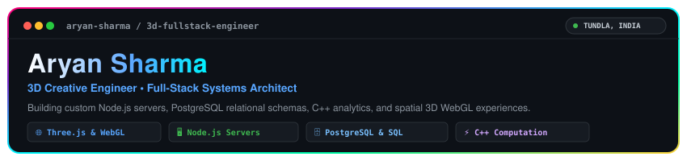
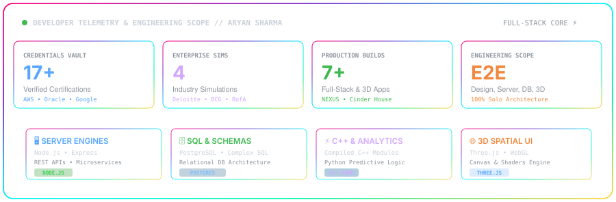
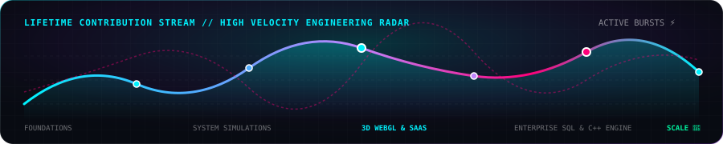
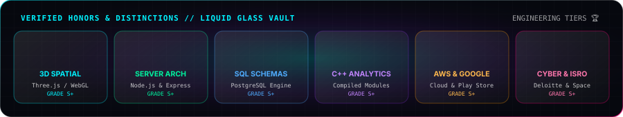

<div align="center">

  <!-- BESPOKE APPLE LIQUID GLASS HERO BANNER -->
  <a href="https://aaddi1.github.io/My-Portfolio/">
    
  </a>

  <!-- DYNAMIC TYPING SVG SUBHEADER -->
  <a href="https://aaddi1.github.io/My-Portfolio/">
    
  </a>

  <p align="center">
    <strong>📍 Pune, Maharashtra, India 🇮🇳 &bull; 🌐 Global Remote &bull; 🚀 Available for High-Impact Roles & Contracts</strong>
  </p>

  <!-- SOCIAL & DIRECT CONNECT MATRIX -->
  <p align="center">
    <a href="mailto:aaddisharmarkczw@gmail.com">
      
    </a>
    <a href="https://www.linkedin.com/in/aryan-sharma11/" target="_blank">
      
    </a>
    <a href="https://x.com/aryan56710" target="_blank">
      
    </a>
    <a href="https://www.instagram.com/aryansharma.dev/" target="_blank">
      
    </a>
    <a href="https://github.com/aaddi1" target="_blank">
      
    </a>
    <a href="https://aaddi1.github.io/My-Portfolio/" target="_blank">
      
    </a>
  </p>

</div>

---

### 🛰️ SYSTEM OVERVIEW // ABOUT ME

```yaml
identity:
  name: "Aryan Sharma"
  title: "3D Designer & Creative Full-Stack Engineer"
  location: "Pune, Maharashtra, India 🇮🇳"
  email: "aaddisharmarkczw@gmail.com"
  core_domain: "3D Spatial Web, Full-Stack Architecture, Polyglot Engineering & Agentic AI"
  design_paradigm: "Apple Clear Liquid Glass UI • High-Performance WebGL • Reactive Systems"
  credentials_count: "17+ Verified Industry Certifications & 4 Enterprise Job Simulations"
  status: "Open for high-velocity engineering roles, contracts & ambitious builds"
```

I am a certified creative engineer and web developer bridging the frontier between **hyper-aesthetic 3D interaction design** and **scalable enterprise engineering**. I don't just build websites; I engineer memorable digital ecosystems—ranging from luxury spatial 3D experiences with custom WebGL shaders to data-intensive business intelligence backends.

* **🎨 3D & Creative Engineering:** Specializing in Three.js, WebGL canvas rendering, spatial UX, Liquid Glass aesthetics, and smooth scroll kinematics.
* **⚡ Polyglot Engine:** Proficient across multiple paradigms—from low-level performance with **C++** and **Java** to high-velocity full-stack builds in **JavaScript**, **TypeScript**, **Python**, and **SQL**.
* **⚙️ Full-Stack Systems:** End-to-end platform design with Node.js, PostgreSQL, Python analytics acceleration, and modern C++.
* **🤖 AI & Agentic Orchestration:** Certified across Anthropic Claude Code, Prompt Engineering, and IBM AI Fundamentals for autonomous development workflows.
* **💼 Business Driven:** Engineering digital solutions that elevate brand valuation, convert users effortlessly, and automate complex workflows.

---

### 📊 DEVELOPER TELEMETRY & LIFETIME STATS

<div align="center">
  <!-- LIQUID GLASS DEVELOPER TELEMETRY DASHBOARD -->
  

  <br /><br />

  <!-- HIGH VELOCITY CONTRIBUTION WAVE RADAR -->
  

  <br /><br />

  <!-- VERIFIED HONORS & LIQUID GLASS TROPHY VAULT -->
  
</div>

---

### 💻 POLYGLOT SPECTRUM // ALL PROGRAMMING LANGUAGES SHOWCASE

<div align="center">
  <!-- FULL PROGRAMMING LANGUAGES MATRIX -->
  
</div>

<br />

| Language | Primary Focus & Domain | Applied In | Ecosystem Badges |
| :--- | :--- | :--- | :---: |
| **JavaScript (ESNext)** | Asynchronous Architectures, Three.js 3D Viewports, Full-Stack DOM & Node Runtime | Full-Stack SaaS & 3D Web |  |
| **TypeScript** | Type-Safe Architecture, Interfaces, Generics, Scalable Web Applications | Frontend & API Engines |  |
| **Python** | Predictive Analytics, Data Modeling, Automation & AI Agent Orchestration | NEXUS Analytics & BCG X |  |
| **C++** | High-Throughput Computation, Algorithmic Acceleration & Memory Optimization | NEXUS Engine & Core Logic |  |
| **Java** | Object-Oriented Design, JVM Runtime Principles, Enterprise Systems | Oracle Certified Foundations |  |
| **SQL / PostgreSQL** | Relational Data Modeling, Complex Queries, Index Optimization & Telemetry | Enterprise Databases & CRM |   |
| **C# / .NET** | Modern Component Architecture & WebAssembly Frameworks | Microsoft Blazor Systems |   |
| **HTML5 & Canvas** | 2D/3D Canvas Rendering, Semantic Layouts, Web Graphics & Audio APIs | 3D Portfolio & Cinder House |  |
| **CSS3 / SCSS** | Liquid Glass UI, 3D CSS Matrix Transforms, Responsive Design Systems | Spatial UX & Themes |  |
| **GLSL / Shaders** | WebGL Custom Shaders, Real-Time Lighting, Raymarching & Textures | 3D Interactive Experiences |  |
| **Bash / Shell** | Terminal Automation, Claude Code Agentic Workflows, DevOps Pipelines | Linux CLI & Tooling |  |

---

### 🛠️ TECHNICAL ARSENAL & SKILLS MATRIX

<table>
  <tr>
    <th width="28%" align="left">DOMAIN</th>
    <th width="72%" align="left">TECHNOLOGIES & TOOLING</th>
  </tr>
  <tr>
    <td><strong>🌐 3D & Creative Tech</strong></td>
    <td>
      
      
      
      
      
      
    </td>
  </tr>
  <tr>
    <td><strong>⚡ Core Languages</strong></td>
    <td>
      
      
      
      
      
      
      
      
      
    </td>
  </tr>
  <tr>
    <td><strong>🚀 Full-Stack & Backend</strong></td>
    <td>
      
      
      
      
      
      
    </td>
  </tr>
  <tr>
    <td><strong>🤖 AI & Agentic Tooling</strong></td>
    <td>
      
      
      
      
      
    </td>
  </tr>
  <tr>
    <td><strong>☁️ Cloud & Infrastructure</strong></td>
    <td>
      
      
      
      
      
      
    </td>
  </tr>
</table>

---

### 🚀 FEATURED FLAGSHIP PROJECTS

<div align="center">
  <table>
    <tr>
      <td width="50%" valign="top">
        <h3 align="center">🏢 NEXUS Platform</h3>
        <p align="center"><strong>Enterprise Business Intelligence & Operations</strong></p>
        <p>Full-stack business management platform featuring real-time CRM, multi-warehouse inventory tracking, automated invoicing, and predictive BI driven by Python & C++ backend analytics.</p>
        <p align="center">
          <code>Node.js</code> • <code>PostgreSQL</code> • <code>Python</code> • <code>C++</code> • <code>REST API</code>
        </p>
        <p align="center">
          <a href="https://github.com/aaddi1/NEXUS">
            
          </a>
        </p>
      </td>
      <td width="50%" valign="top">
        <h3 align="center">🏨 Cinder House</h3>
        <p align="center"><strong>Luxury Boutique Hotel 3D Experience</strong></p>
        <p>Immersive 3D boutique hotel website engineered with Three.js, WebGL canvas rendering, responsive spatial visuals, fluid parallax micro-animations, and liquid glass styling.</p>
        <p align="center">
          <code>Three.js</code> • <code>WebGL</code> • <code>Liquid Glass UI</code> • <code>JavaScript</code> • <code>3D Graphics</code>
        </p>
        <p align="center">
          <a href="https://github.com/aaddi1/Cinder-House">
            
          </a>
        </p>
      </td>
    </tr>
    <tr>
      <td width="50%" valign="top">
        <h3 align="center">✨ Interactive 3D Portfolio</h3>
        <p align="center"><strong>24fps Scroll Canvas Engine & UI Suite</strong></p>
        <p>High-performance interactive 3D web experience with Apple-inspired Clear Liquid Glass UI architecture, dynamic credential viewer, and live interaction pipelines.</p>
        <p align="center">
          <code>Three.js</code> • <code>HTML5 Canvas</code> • <code>Modern CSS</code> • <code>Spatial UX</code>
        </p>
        <p align="center">
          <a href="https://aaddi1.github.io/My-Portfolio/">
            
          </a>
          <a href="https://github.com/aaddi1/My-Portfolio">
            
          </a>
        </p>
      </td>
      <td width="50%" valign="top">
        <h3 align="center">⚖️ Advocate Web Platform</h3>
        <p align="center"><strong>Modern Legal Tech & Client Portal</strong></p>
        <p>Professional law firm and advocate web platform designed to establish high-trust client relationships, streamline intake flows, and facilitate direct legal consultations.</p>
        <p align="center">
          <code>HTML5</code> • <code>CSS3</code> • <code>JavaScript</code> • <code>Responsive Architecture</code>
        </p>
        <p align="center">
          <a href="https://github.com/aaddi1/Advocate-webpage">
            
          </a>
        </p>
      </td>
    </tr>
  </table>
</div>

---

### 🎖️ VERIFIED CREDENTIALS & INDUSTRY HONORS

<div align="center">
  <p>Official certifications and completion credentials awarded to <strong>Aryan Sharma</strong>. Click on any credential to inspect the verified asset.</p>
</div>

| Category | Credential & Specialization | Issuing Body / Organization | Verification Link |
| :--- | :--- | :--- | :---: |
| 🤖 **AI & Agentic** | **Claude Code in Action** | Claude Academy (Anthropic PBC) | [Inspect Badge ↗](https://github.com/aaddi1/My-Portfolio/blob/main/certificates/claude_code_in_action.png) |
| 🤖 **AI & Agentic** | **Claude Code 101** | Claude Academy (Anthropic PBC) | [Inspect Badge ↗](https://github.com/aaddi1/My-Portfolio/blob/main/certificates/claude_code_101.png) |
| 🤖 **AI & Agentic** | **Claude 101 Certification** | Claude Academy (Anthropic PBC) | [Inspect Badge ↗](https://github.com/aaddi1/My-Portfolio/blob/main/certificates/claude_101.png) |
| 🤖 **AI & Agentic** | **AI Fundamentals** (ID: ea9a30e3) | IBM SkillsBuild | [Inspect Credential ↗](https://github.com/aaddi1/My-Portfolio/blob/main/certificates/ibm_ai_fundamentals.pdf) |
| 🤖 **AI & Strategy** | **GenAI Job Simulation** | Boston Consulting Group (BCG X) | [Inspect Credential ↗](https://github.com/aaddi1/My-Portfolio/blob/main/certificates/bcgx_certificate.pdf) |
| 🤖 **AI & Logic** | **Critical Thinking in the Age of AI** | HP LIFE | [Inspect Credential ↗](https://github.com/aaddi1/My-Portfolio/blob/main/certificates/critical_thinking_ai.pdf) |
| ☁️ **Cloud & Mobile** | **Google Play Store Listing Certificate** | Google Play Academy (ID: 194626223) | [Inspect Credential ↗](https://github.com/aaddi1/My-Portfolio/blob/main/certificates/google_play_store_listing.pdf) |
| ☁️ **Cloud & DevOps**| **AWS Developer Learning Plan** | Amazon Web Services (AWS) | [Inspect Credential ↗](https://github.com/aaddi1/My-Portfolio/blob/main/certificates/aws_training.pdf) |
| ☁️ **Cloud & DevOps**| **AWS Cloud Computing & Scaler** | Scaler Academy & AWS | [Inspect Credential ↗](https://github.com/aaddi1/My-Portfolio/blob/main/certificates/scaler_certificate.png) |
| 🛰️ **Space & Remote**| **ISRO / IIRS Outreach Program** | Indian Space Research Organisation | [Inspect Credential ↗](https://github.com/aaddi1/My-Portfolio/blob/main/certificates/isro_edusat_outreach.pdf) |
| ☕ **Software Eng**  | **Java Learning Explorer Badge** | Oracle University | [Inspect Badge ↗](https://github.com/aaddi1/My-Portfolio/blob/main/certificates/oracle_java_badge.png) |
| 🛡️ **Cybersecurity** | **Cyber Security Job Simulation** | Deloitte | [Inspect Credential ↗](https://github.com/aaddi1/My-Portfolio/blob/main/certificates/deloitte_cyber_simulation.pdf) |
| 📈 **Fintech & Quant**| **Global Markets Sales & Trading Analyst**| Bank of America | [Inspect Credential ↗](https://github.com/aaddi1/My-Portfolio/blob/main/certificates/bank_of_america_certificate.pdf) |
| 💼 **Consulting**    | **Management Consulting Simulation** | Mastercard Advisors | [Inspect Credential ↗](https://github.com/aaddi1/My-Portfolio/blob/main/certificates/mastercard_advisors_consulting.pdf) |
| 💻 **Full-Stack**    | **Full-Stack Development 101** | Accredited Program | [Inspect Credential ↗](https://github.com/aaddi1/My-Portfolio/blob/main/certificates/fullstack_development_101.pdf) |
| 📊 **Data Science**  | **SQL for Data Science** | Enterprise Data Specialization | [Inspect Credential ↗](https://github.com/aaddi1/My-Portfolio/blob/main/certificates/sql_for_data_science.pdf) |
| 🌐 **Modern Web**    | **Introduction to Blazor** | Microsoft Web Ecosystem | [Inspect SVG ↗](https://github.com/aaddi1/My-Portfolio/blob/main/certificates/intro_to_blazor.svg) |

---

### 💬 INITIATE COLLABORATION // CONTACT HUD

<div align="center">
  <p>Got an ambitious project, 3D experience, full-stack platform, or engineering role? Reach out directly.</p>

  <p align="center">
    <a href="mailto:aaddisharmarkczw@gmail.com">
      
    </a>
    <a href="https://www.linkedin.com/in/aryan-sharma11/">
      
    </a>
    <a href="https://x.com/aryan56710">
      
    </a>
    <a href="https://www.instagram.com/aryansharma.dev/">
      
    </a>
    <a href="https://aaddi1.github.io/My-Portfolio/">
      
    </a>
  </p>

  <br />

  

  <br /><br />

  <p align="center">
    <sub>Crafted with ⚡ and precision by <strong>Aryan Sharma</strong> &bull; Direct Contact: <strong><a href="mailto:aaddisharmarkczw@gmail.com">aaddisharmarkczw@gmail.com</a></strong></sub>
  </p>
</div>
